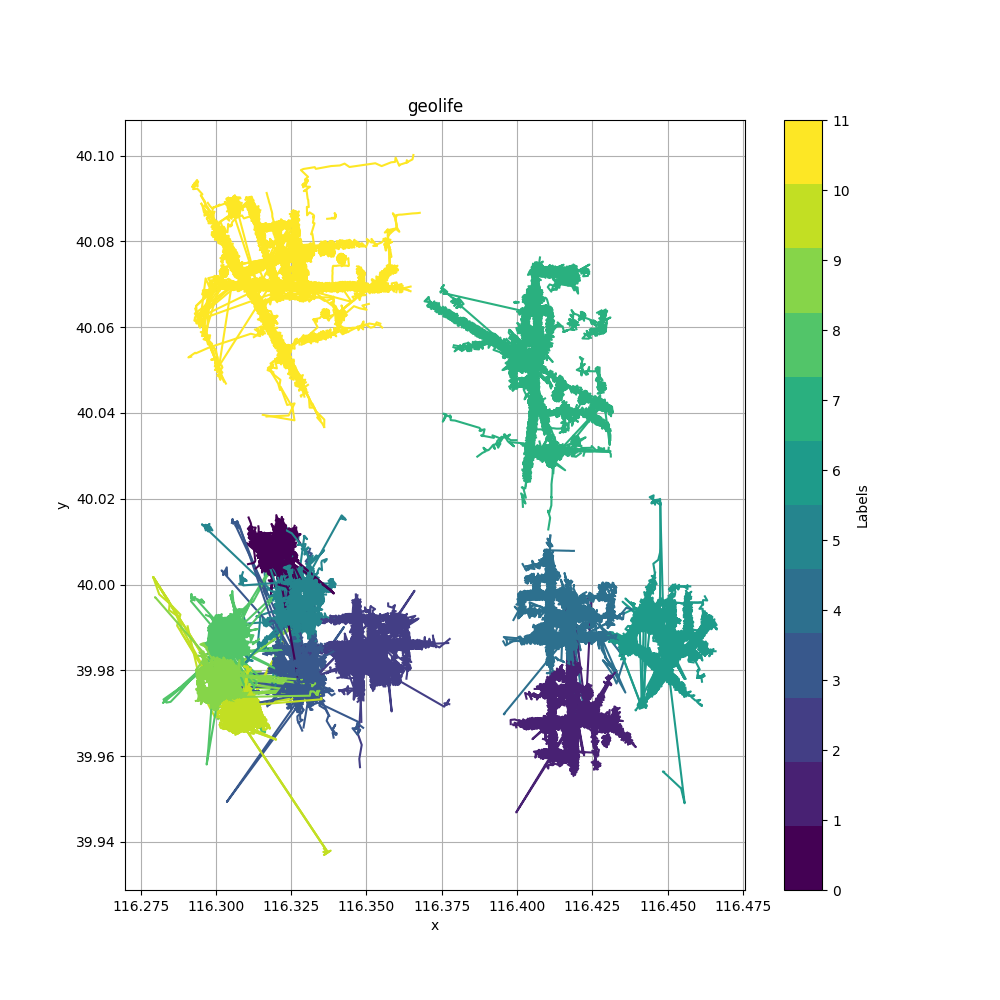
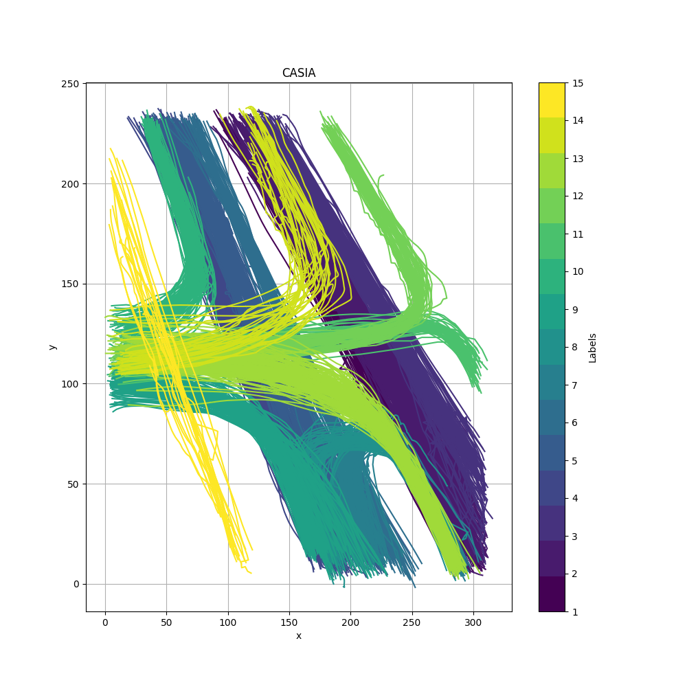
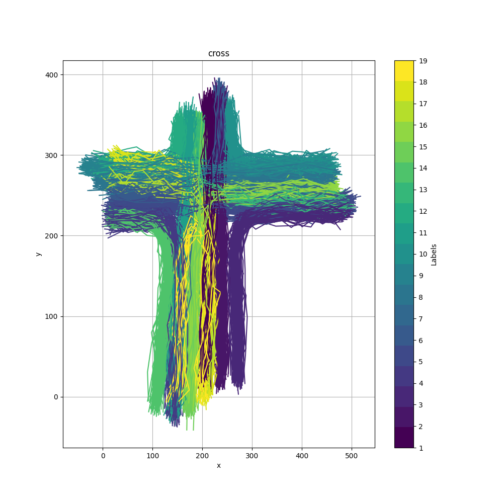
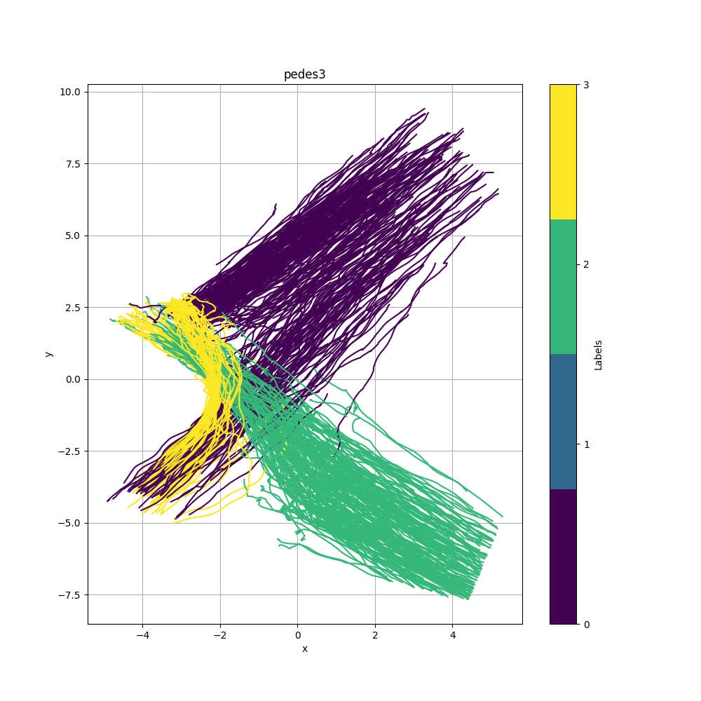
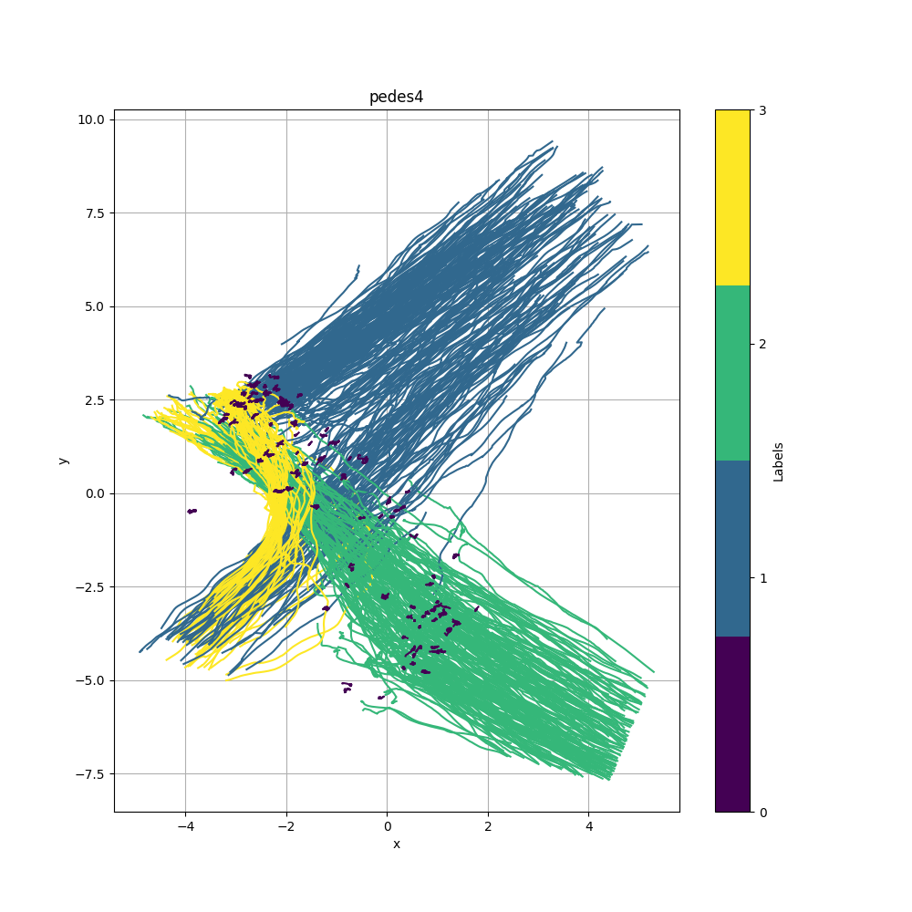
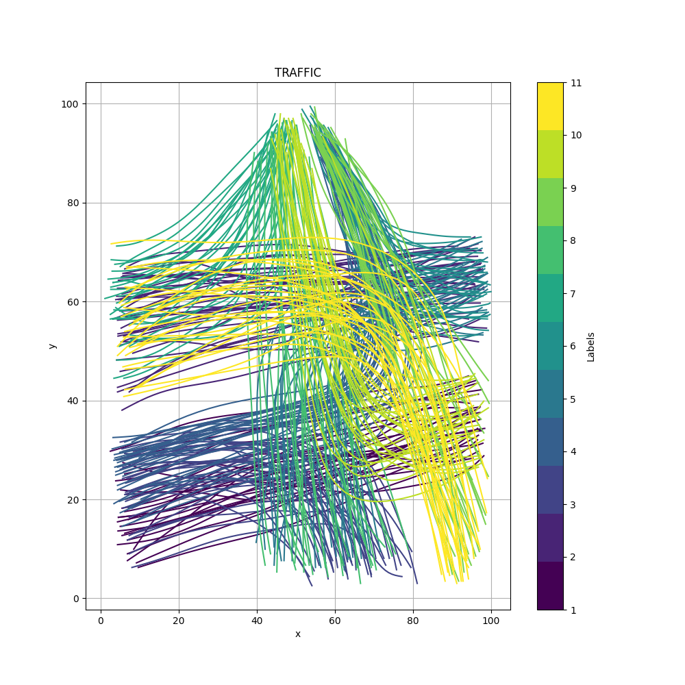
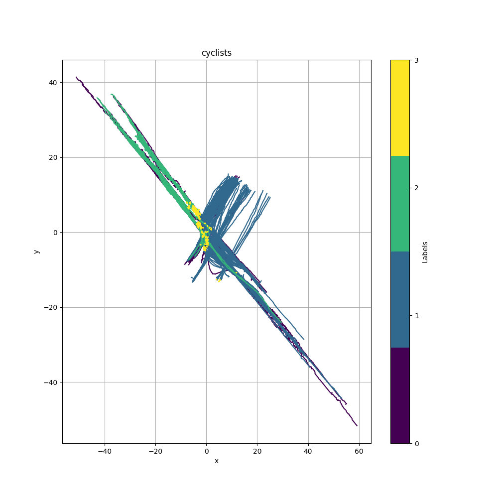

A group project for CSIT 5210 (Data Mining and Knowledge Discovery)
Group 3
RABOT Clovis
GONZALES Erwan
LIU Runrong
ZHANG Zexuan
ARSHAD Muhammad Hassan
SMITH Caroline

https://github.com/IsolationKernel/TIDKC

### Dataset Info

1. **Geolife**

   - number of trajectories: 9192
   - classes: 12
   - keys: data, label

   

2. **CASIA**

   - number of trajectories: 1500
   - numer of classes: 15
   - keys: data, class

   

3. **cross**

   - number of trajectories: 1900
   - number of classes: 19
   - keys: data, class

   

4. **pedes3**

   - number of trajectories: 610
   - number of classes: 4
   - keys: data, class

   

5. **pedes4**

   - number of trajectories: 710
   - number of classes: 4
   - keys: data, class

   

6. **TRAFFIC**

   - number of trajectories: 300
   - number of classes: 11
   - keys: data, class

   gpt-4:

   > The loaded data from the 'TRAFFIC.mat' file is a 3-dimensional array with the shape (300, 50, 2). This suggests that the data consists of 300 trajectories, each with 50 data points, and each data point has 2 values.
   >
   > Generally, in trajectory data, each trajectory is a sequence of data points, where each data point is a multi-dimensional vector. Here, it seems each data point is a 2-dimensional vector (possibly representing coordinates like longitude and latitude, or x and y positions).
   >
   > So, in this case, the data is structured as follows:
   >
   > - The first dimension (300) represents the number of trajectories.
   > - The second dimension (50) represents the number of data points in each trajectory.
   > - The third dimension (2) represents the dimensionality of each data point.

​	

7. **cyclists**

   - number of trajectories: 494
   - number of classes: 4
   - keys: data, class

   > 'moving': 0, 'starting': 1, 'stopping': 2, 'waiting': 3

